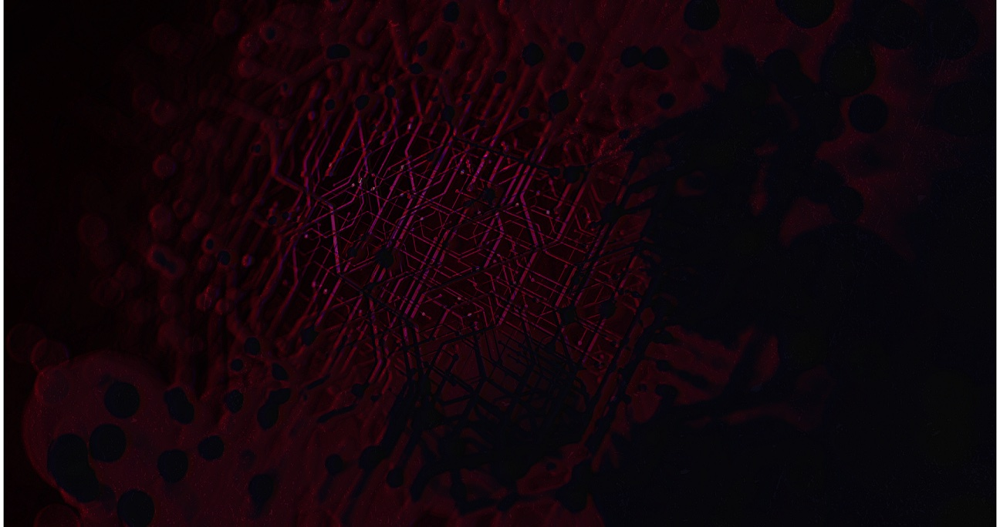
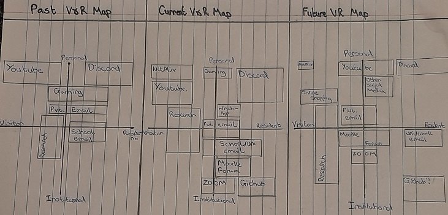

# The Existential Threat of Artificial Intelligence

## Introduction 

This article will critically evaluate the hypothesis suggesting that considerable progress in artificial intelligence (AI) technology will result in either human extinction or severely damaging humanity, or any wider damage to human society that may cause a recession. The article will also cover digital identities and analyze them utilizing David White's visitor and resident model [5] while comparing it to the original natives versus immigrants' notion of the internet and relating this to the advancement of AI and technology. Artificial intelligence refers to giving machines and human constructs the ability to simulate human intelligence. Stanford Professor John McCarthy labeled this "the science and engineering of making intelligent machines." [^1] Though generally applied to computer systems, it applies to effectively all man-made machines.

 
### What are some current uses of AI?

AI is currently used across an exasperating variety of fields to automate certain processes and decrease cost while maintaining cost efficiency; examples of this include automated voice assistants on phone lines and computer systems that manage inventory or stocks. A morally debatable use of artificial intelligence includes advertising algorithms like those of YouTube, TikTok, or other social media, as some research has discovered benefits like improved mood, better mental functioning, and increased social support (Ellison et al. 2007, Myhre et al. 2017, Park et al. 2009, Patel et al. 2015, Primack, and Escobar-Viera 2017, cited from a meta-analysis by Cunningham, S., Hudson, C.C., & Harkness) [^2]. The issue with this type of AI is that, while it does not pose an overt direct existential threat, the isolation and increase in negative emotions can have an impact on people, and long-term effects, when combined with other issues, can pose a threat. More obvious immorality in AI usage can be linked to systems with more nefarious purposes, such as malware that tracks your files or displays some threatening message; even worse would be automated targeting systems and the like for military weaponry, which, while arguably necessary, will result in the loss of life.

 
### Digital Identities

Digital identities refer to our presence online and our use of the internet. Digital identities were initially seen as static; this was referred to as the "natives and residents model" (Mark Prensky, 2001) [3]. The general idea is that people from previous generations would be internet immigrants who would never be able to use it effectively, whereas younger generations were viewed as natives who could navigate the internet quickly and efficiently. It soon became clear that this model was flawed, as people were not effectively using the internet for education. On the other hand, David White's Visitor and Residents Model (V&R) is a fluid model utilizing a mapping process to allow individuals to map out the online activity that they can then analyze. It consists of a vertical and a horizontal line. On the vertical line, on opposite ends, fit personal and institutional. "Personal" refers to uses of the internet where the aim is some sort of personal gain, be it a piece of information for your knowledge or communicating with friends. Contrastingly, institutional uses of the internet refer to any use where the goal is achieving something for work or school. On the horizontal line, visitors and residents are placed. The visitor end refers to employing the internet as a tool and using it to access or gain information without leaving a social trace. On the other hand, the resident end refers to anything that can involve leaving a social trace, for example sending emails or interacting with posts or people on social media. An essay by Curiosity introduces the idea that attention is the currency of the internet and portrays this as a system where people are farmed for their attention like animals. This supports the V&R model as it denotes the inefficient part of someone's digital portfolio, specifically the personal resident portion on sites that are used to deliver an addictive dopamine rush, which can lead to procrastination and inefficient use of time and the internet as a tool. For example, in my portfolio below.

### Analysis

In the past, my online activities were effectively exclusively personal with a large chunk of that being residential focussed on playing games and socializing with friends and strangers alike, with frequent use of sites such as youtube to watch videos or listen to music for entertainment. My V&R Map demonstrated that in the past I employed the internet for a bit of research for any homework or project I may have due, but it was primarily employed for entertainment and personal reasons. Right now, it demonstrates the use of a plethora of personal resident activities like social media but includes a small but wide field of institutional uses like my university email and some research for projects like this one or something related to my other endeavors at university. Both in the past and now my use of the internet has been to a large degree personal and has also contributed to procrastination, to prevent this I am hoping to shift my digital identity to utilize a lot less residential and still maintain some social media, but to limit addictive sites like youtube shorts for example, and youtube, in general, to prevent being lead astray from my work. This would lead to more productive use of time and hence it is a challenge.
 
  
What is the relationship between existential threats and AI?
  
There was an aforementioned reference to the effects that excessive use of the internet has on someone's mental health; this is often induced by AI to trap users. This demonstrates that currently, AI is blending in with our normal use of the internet. This is somewhat consistent with David Clark's prediction that it will become a part of daily life and blend in with reality. Deepfakes are videos and images that are altered in a manner that can emulate someone's voice or imagery to demonstrate actions that never occurred. A research article by Jiameng Pu et al. (2020) [4] would suggest deepfakes are not as dangerous as they may appear (referred to as "generative adversarial networks" in the study). They achieve a 99.68% detection rate for deepfakes using "Noisescope." Is it a reasonable expectation that every media outlet, pundit, and an individual would utilize the appropriate technology? A fictional example of AI affecting humanity is found in the theme of "Cyberpunk," which can be summarised as a synthesis of lowlife and high-tech, with technological advances such as AI and cybernetics juxtaposed against societal collapse. It is thus debatable, and I would argue that it is true, that integrating AI too deeply into our lives, for example, as part of our bodies, could result in a severe dystopian future. After all, criminals would gain access to abilities that allow them to cause more chaos, and in turn, military combat would become even more frightening and dangerous with computerized enhancements and body implants that would cause much more death and havoc due to increased destructive capacity. The implants presented in cyberpunk frequently involve the replacement of whole body parts or even the insertion of cybernetic parts that affect the mind. The big difference in cyberpunk is that the more parts are linked to you, the less human you become and the greater the chances of you becoming a "cyber psycho," which is effectively summarised as a mindless beast that kills and destroys anyone or anything, which quite directly argues that we could become beasts if we lose ourselves, we can argue that we become either less or more than humans, but would it still be accurate to call us humans? The theme here is that descending into "moral degeneracy" by abandoning what makes us human and giving up our roots, we will stop progressing as a tree without its roots shrivels and dies, hence we will be doomed to self-destruction. Alternate media like Walle approach a similar theme of a loss of choice, though there are no bodily implants. Instead, it features an AI that denies humans access to Earth and knowledge of its having life, albeit a single plant, to return it to being uninhabitable for life, even though this was its original purpose and design; it does not allow people to be informed and override that decision, instead attempting to make them wholly dependent on it as their sole provider, implying a dangerous future despite the wholesome and happy ending. An indication is that AI and normal life become one, and hence everyone's visitor and resident maps in this dystopian future become fully personal and fully institutional in the residential sector as we are unable to prevent a melding of the two existences.

     
## Bibliography

[^1]Andresen, S. L. (2002). John McCarthy: father of AI. IEEE Intelligent Systems, 17(5), 84–85.

[2]Cunningham, S., Hudson, C.C., & Harkness, K. Social Media and Depression Symptoms: A Meta-Analysis Child and Adolescent Psychopathology, 49, 241-253 (2021).https://doi.org/10.1007/s10802-020-00715-7.

[^3]Prensky, M. (2005). Digital natives, digital immigrants. Gifted, (135), 29-31.

[4] Pu, J., Mangaokar, N., Wang, B., Reddy, C. K., & Viswanath, B. (2020, December). Noisescope: detecting fake images in a blind setting. Annual computer security applications conference (pp. 913–927)

[5]Visitor and Resident Map David White: Credibility [YouTube video of David White] (https://www.youtube.com/watch?v=kO569eknM6U&t=506s) 

[5]Visitor and Resident Map David White: Open Practice [2nd YouTube video of David White] (https://www.youtube.com/watch?v=1X0g2OvSdWc)
